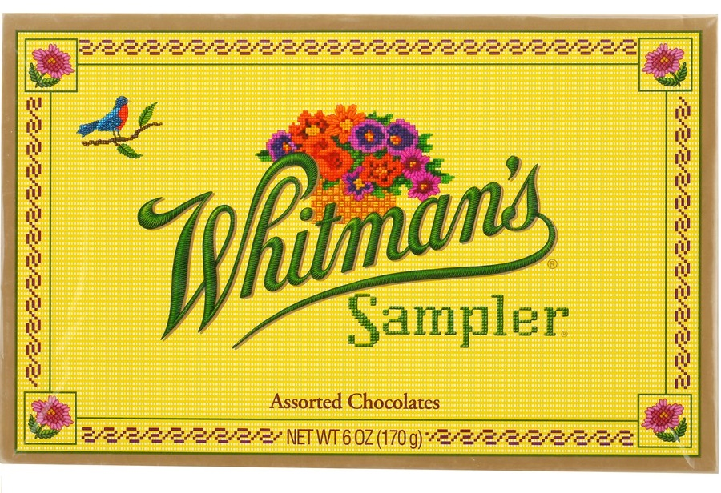

I have made this blog to report and share some of the projects I have worked on or am currently working on.

I have named this blog after the sharable chocolate gift pack, Whitman's Sampler. Although it is fairly standard chocolate by today's standards, the attractive and sturdy cardboard box was often reused by my grandparents to store useful items such as sewing kits, craft items and other small tools. This repurposing of this unassuming confectionary item resulted in the disappointment of my young self looking for chocolate in my grandparent's house and finding an clothing alteration kit. Nonetheless, enjoyment still resulted in the respective mayhem of learning and using the items found in the box, despite not originally intending to.

Much like my Whitman's sampler experience, the purpose of doing these small projects detailed in this blog is to:
- Challenge myself to try to solve a problem
- Encounter interests and areas of knowledge that I otherwise would not have attempted
- Develop useful skills for both real world problems and industry

and
- have fun
